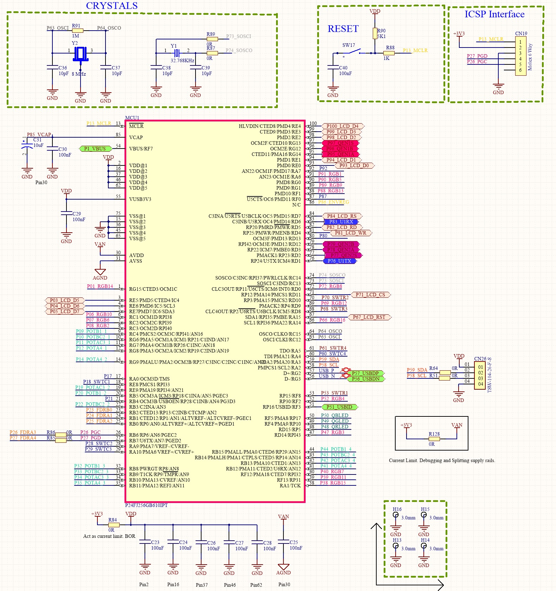

# P24FJ28GB610
Individual blocks of the microcontroller PIC 24FJ128GB610 are developed in this repository.

_HARDWARE_

To establish communication with the microcontroller a minimum set up with decoupling capacitor is required. 
External oscillators are optional, and not necessary for running the microcontroller.

## INI_P24FJ128GB610.X
This folder contains the initialization project. This project will initialize the microcontroller and toggle a pin to acknowledge *running status*.

## ADC_P24FJ128GB610.X
This project contains necessary files to initialize ADC module. It will toggle a port at a rate determine by the ADC read.

## TMR_P24FJ128GB610.X
This project allows you to use any timer of the microcontroller to toggle a port at frequency that you wish.

## UART_P24FJ128GB610.X
Basics for serial communication protocol. 

## LCD__P24FJ128GB610.X
Example of interconexion with a LCD 16x2 display using parallel communication or I2C

## I2C_P24FJ128GB610.X
This project uses I2C serial protocol to control the LCD 16X2.
